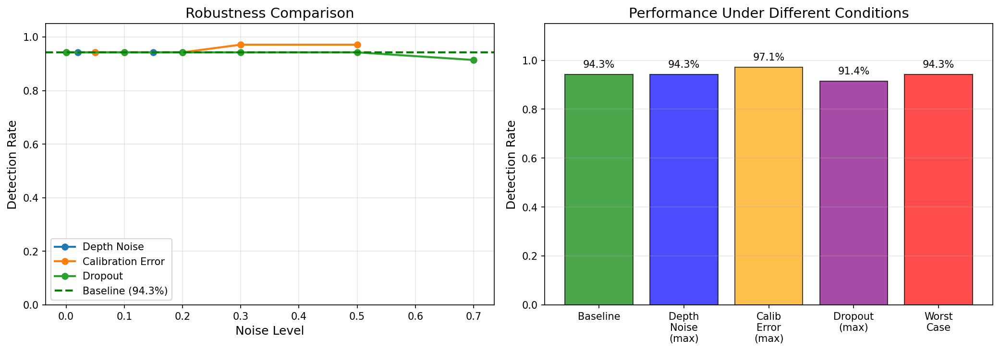

<h1 align="center">
  Multi-Sensor Perception Pipeline
</h1>

<p align="center">
  <pre align="center">
    ╔═══════════════════════════════════════════════════════════════╗
    ║   📷 CAMERA  +  📡 LiDAR  →  🎯 3D DETECTION                 ║
    ╚═══════════════════════════════════════════════════════════════╝
  </pre>
</p>

<p align="center">
  <strong>Camera-LiDAR Fusion for 3D Object Detection in Autonomous Vehicles</strong>
</p>

<p align="center">
  <a href="#key-features">Features</a> •
  <a href="#quick-start">Quick Start</a> •
  <a href="#architecture">Architecture</a> •
  <a href="#results">Results</a> •
  <a href="#documentation">Docs</a>
</p>

<p align="center">
  
  
  
  
</p>

---

## Problem Statement

Autonomous vehicles require accurate 3D perception of their environment to navigate safely. While cameras provide rich semantic information and LiDAR offers precise depth measurements, neither sensor alone is sufficient for robust 3D object detection. This project implements a **late fusion pipeline** that combines the strengths of both sensors:

- **Camera**: High-resolution 2D detection with YOLOv8 (semantic understanding)
- **LiDAR**: Precise depth estimation from projected point clouds (geometric accuracy)
- **Fusion**: Lifts 2D detections to 3D using LiDAR depth within bounding boxes

```
Input Frame                          Output Visualization
┌────────────────────┐              ┌────────────────────┐
│  🚗    🚶  🚗      │   Fusion    │  [Car: 15.2m]      │
│     Camera RGB     │ ─────────▶  │  [Ped: 8.4m]       │
│                    │             │  Bird's Eye View    │
└────────────────────┘              └────────────────────┘
         +                                   ↓
┌────────────────────┐              ┌────────────────────┐
│  ·  ·  · ·  · ·    │              │  ┌───┐             │
│    LiDAR Points    │              │  │ego│ ←── You     │
│  ·  ·   ·  ·  ·    │              │  └───┘    ┌───┐    │
└────────────────────┘              │           │Car│    │
                                    └────────────────────┘
```

## Key Features

| Feature | Description |
|---------|-------------|
| **2D Detection** | YOLOv8m with 97.7% recall on KITTI |
| **Depth Estimation** | Robust median depth from projected LiDAR points |
| **3D Box Generation** | Class-aware dimension priors with depth lifting |
| **Bird's Eye View** | Waymo/Tesla-style visualization |
| **Robustness** | Maintains 91%+ detection under 70% point dropout |
| **Evaluation Suite** | Comprehensive metrics with PR curves, confusion matrices |

## Architecture

```
┌─────────────────────────────────────────────────────────────────┐
│                    PERCEPTION PIPELINE                          │
├─────────────────────────────────────────────────────────────────┤
│                                                                 │
│   ┌──────────┐         ┌──────────┐         ┌──────────┐       │
│   │  Camera  │         │  LiDAR   │         │  Calib   │       │
│   │  Image   │         │  Points  │         │  (K,R,T) │       │
│   └────┬─────┘         └────┬─────┘         └────┬─────┘       │
│        │                    │                    │              │
│        ▼                    │                    │              │
│   ┌──────────┐              │                    │              │
│   │ YOLOv8m  │              │                    │              │
│   │ Detector │              │                    │              │
│   └────┬─────┘              │                    │              │
│        │                    │                    │              │
│        ▼                    ▼                    ▼              │
│   ┌─────────────────────────────────────────────────┐          │
│   │              SENSOR FUSION MODULE               │          │
│   │  ┌─────────────┐  ┌─────────────┐  ┌─────────┐ │          │
│   │  │   Project   │→ │    Depth    │→ │   3D    │ │          │
│   │  │  LiDAR→2D   │  │  Estimator  │  │  BBox   │ │          │
│   │  └─────────────┘  └─────────────┘  └─────────┘ │          │
│   └─────────────────────────────────────────────────┘          │
│                              │                                  │
│                              ▼                                  │
│                    ┌──────────────────┐                        │
│                    │  3D Detections   │                        │
│                    │ (x,y,z,l,w,h,θ)  │                        │
│                    └──────────────────┘                        │
│                                                                 │
└─────────────────────────────────────────────────────────────────┘
```

For detailed architecture documentation, see [docs/architecture.md](docs/architecture.md).

## Results

### Detection Performance

| Metric | Value | Status |
|--------|-------|--------|
| **2D mAP@0.5** | 0.576 | ✅ Acceptable |
| **2D Recall** | 97.7% | ✅ Excellent |
| **2D Precision** | 51.2% | ⚠️ Moderate |
| **Mean Center Error** | 1.42m | ✅ Acceptable |
| **3D IoU** | 0.085 | ⚠️ Needs improvement |

### Per-Class Performance

| Class | AP@0.5 | Precision | Recall |
|-------|--------|-----------|--------|
| Car | 0.750 | 52.4% | 100% |
| Pedestrian | 0.978 | 90.0% | 100% |
| Cyclist | 0.000 | 0.0% | 0.0% |

### Robustness Analysis

| Condition | Detection Rate | Degradation |
|-----------|----------------|-------------|
| Baseline (clean) | 94.3% | — |
| 20% Depth Noise | 94.3% | 0% |
| 0.3m Calibration Error | 97.1% | -3% (improved) |
| 70% Point Dropout | 91.4% | 3% |

<p align="center">
  
</p>

For comprehensive results, see [docs/results.md](docs/results.md).

## Quick Start

### 1. Clone and Install

```bash
git clone https://github.com/yourusername/multi-sensor-perception.git
cd multi-sensor-perception

# Create virtual environment
python -m venv .venv
source .venv/bin/activate  # Linux/Mac
# or: .venv\Scripts\activate  # Windows

# Install dependencies
pip install -r requirements.txt
pip install -e .
```

### 2. Download KITTI Dataset

```bash
python scripts/download_kitti.py
# Or manually download from http://www.cvlibs.net/datasets/kitti/
```

Expected structure:
```
data/kitti/
├── training/
│   ├── image_2/       # Left color images
│   ├── velodyne/      # LiDAR point clouds
│   ├── calib/         # Calibration files
│   └── label_2/       # Ground truth labels
```

### 3. Run the Pipeline

```bash
# Full pipeline with visualization
python scripts/run_pipeline.py --mode multi_panel

# Quick visualization demo
python scripts/run_fusion_viz.py --num-frames 10

# Evaluate metrics
python scripts/eval_metrics.py --num-frames 100

# Test robustness
python scripts/eval_robustness.py --num-frames 50
```

## Project Structure

```
├── configs/                 # YAML configuration files
│   └── default.yaml
├── data/                    # Dataset directory (git-ignored)
│   └── kitti/
├── docs/                    # Documentation
│   ├── architecture.md      # System design
│   ├── results.md           # Evaluation results
│   └── calibration_guide.md # Calibration setup
├── outputs/                 # Generated reports
├── plots/                   # Visualization outputs
├── scripts/                 # Executable scripts
│   ├── run_pipeline.py      # Main pipeline runner
│   ├── run_fusion_viz.py    # Visualization demo
│   ├── eval_metrics.py      # Metrics evaluation
│   └── eval_robustness.py   # Robustness testing
├── src/                     # Source code
│   ├── calibration/         # Camera-LiDAR calibration
│   ├── data/                # Data loaders (KITTI)
│   ├── eval/                # Evaluation metrics
│   ├── fusion/              # Depth estimation & 3D bbox
│   ├── perception2d/        # YOLOv8 detection
│   ├── sensors/             # Sensor interfaces
│   ├── utils/               # Utilities
│   └── viz/                 # Visualization (BEV, overlay)
└── tests/                   # Unit tests
```

## Configuration

Edit `configs/default.yaml`:

```yaml
data:
  root: "data/kitti"
  split: "training"

detector:
  model: "yolov8m"           # n/s/m/l/x variants
  confidence: 0.3            # Detection threshold
  classes: [0, 1, 2]         # car, pedestrian, cyclist

fusion:
  depth_method: "median"     # median/mean/closest
  min_points: 5              # Minimum LiDAR points
  outlier_threshold: 2.0     # Sigma for outlier removal
```

## Documentation

| Document | Description |
|----------|-------------|
| [Architecture](docs/architecture.md) | System design, data flow, modules |
| [Results](docs/results.md) | Quantitative evaluation, comparisons |
| [Calibration Guide](docs/calibration_guide.md) | Camera-LiDAR setup |

## Testing

```bash
# Run all tests
pytest tests/ -v

# With coverage report
pytest tests/ --cov=src --cov-report=html
```

## Technical Highlights

- **Late Fusion Strategy**: Decouples 2D detection from 3D estimation, allowing easy detector upgrades
- **Robust Depth Estimation**: Median-based aggregation handles LiDAR noise and sparse points
- **Class-Aware Priors**: Uses learned dimension priors per object class for more accurate 3D boxes
- **Comprehensive Evaluation**: Full metrics suite including mAP, 3D IoU, distance-binned analysis
- **Robustness Testing**: Systematic evaluation under noise, calibration errors, and sensor dropout

## Limitations & Future Work

### Current Limitations
- Uses fixed dimension priors (no learned dimension regression)
- Simplified yaw estimation (no orientation regression)
- Single-frame processing (no temporal tracking)

### Planned Improvements
- [ ] Add multi-object tracking (SORT/DeepSORT)
- [ ] Implement orientation regression network
- [ ] Support additional datasets (nuScenes, Waymo)
- [ ] Add early/deep fusion variants
- [ ] Real-time optimization (TensorRT)

## Citation

If you use this work, please cite:

```bibtex
@software{multisensor_perception_2026,
  title={Multi-Sensor Perception Pipeline for Autonomous Vehicles},
  author={Your Name},
  year={2026},
  url={https://github.com/yourusername/multi-sensor-perception}
}
```

## Acknowledgments

- [KITTI Vision Benchmark Suite](http://www.cvlibs.net/datasets/kitti/) - Dataset and evaluation protocol
- [Ultralytics YOLOv8](https://github.com/ultralytics/ultralytics) - 2D object detection
- [Open3D](http://www.open3d.org/) - Point cloud visualization

## License

This project is licensed under the MIT License - see [LICENSE](LICENSE) for details.

---

<p align="center">
  <sub>Built with PyTorch, YOLOv8, and Open3D</sub>
</p>
