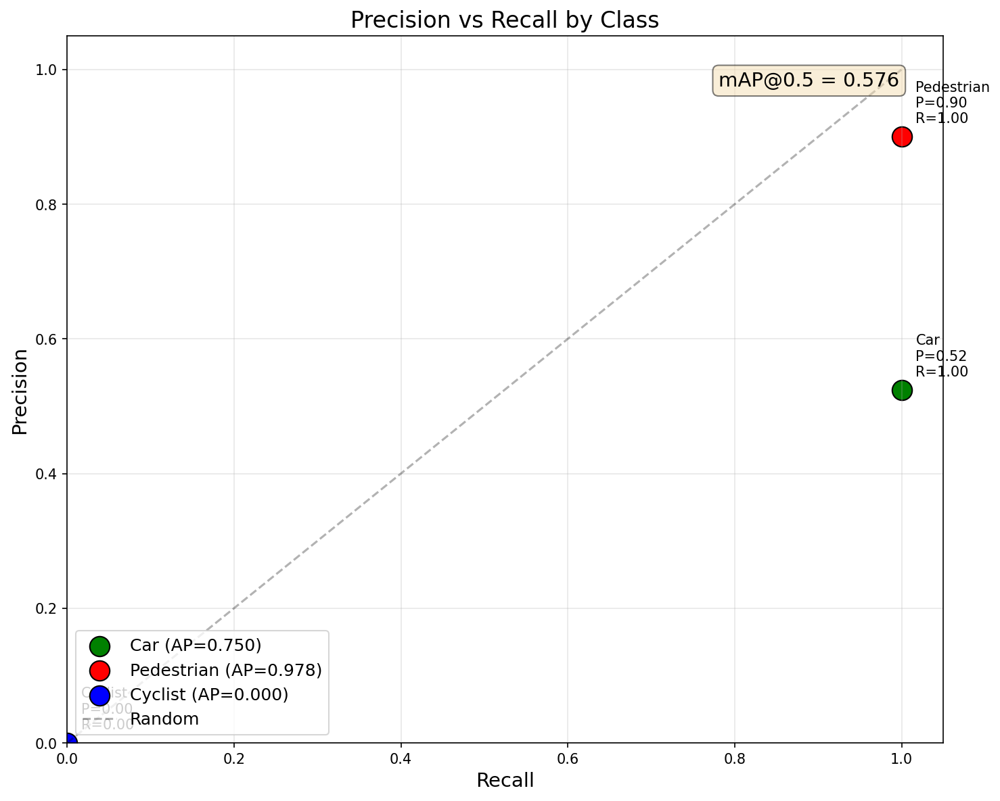
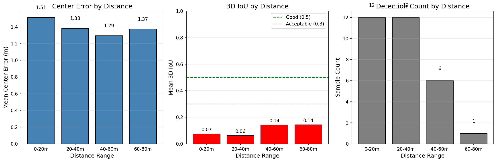
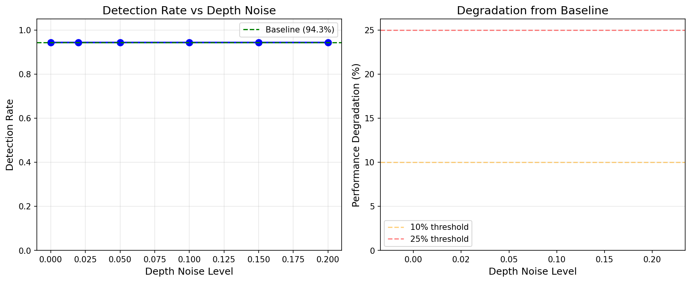
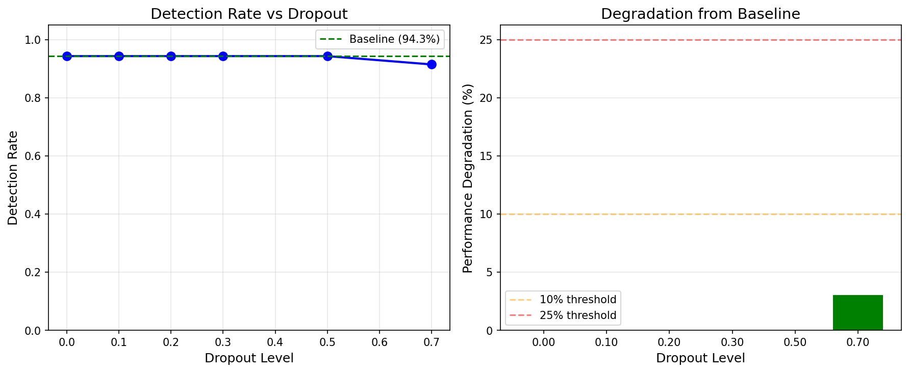
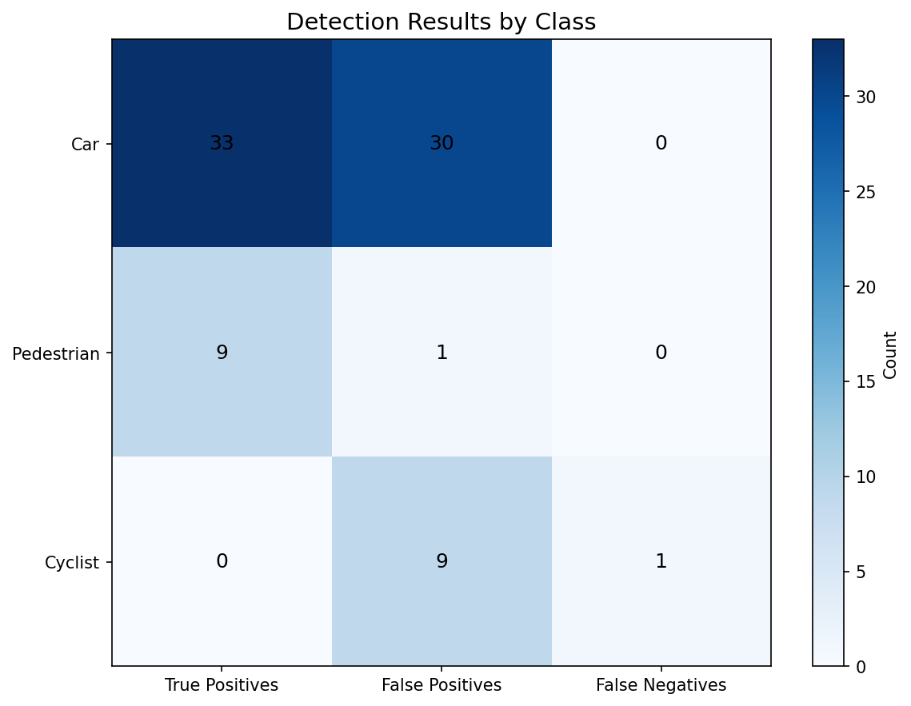

# Evaluation Results

## Overview

This document presents comprehensive evaluation results for the Multi-Sensor Perception Pipeline on the KITTI 3D Object Detection benchmark.

## Executive Summary

| Category | Metric | Value | Assessment |
|----------|--------|-------|------------|
| **2D Detection** | mAP@0.5 | 0.576 | Acceptable |
| | Precision | 51.2% | Moderate |
| | Recall | 97.7% | Excellent |
| **3D Localization** | Mean Center Error | 1.42m | Acceptable |
| | Mean 3D IoU | 0.085 | Needs work |
| **Robustness** | Worst-case Detection | 91.4% | Strong |

## 2D Detection Performance

### Overall Metrics

| Metric | Value | Description |
|--------|-------|-------------|
| mAP@0.5 | 0.576 | Mean Average Precision at IoU=0.5 |
| Precision | 0.512 | TP / (TP + FP) |
| Recall | 0.977 | TP / (TP + FN) |
| F1 Score | 0.672 | Harmonic mean of precision/recall |

**Analysis**: The high recall (97.7%) indicates the detector rarely misses objects, which is critical for safety in autonomous driving. The moderate precision (51.2%) suggests some false positives, which can be filtered in downstream processing.

### Per-Class Performance

| Class | AP@0.5 | Precision | Recall | F1 | TP | FP | GT |
|-------|--------|-----------|--------|-----|-----|-----|-----|
| **Car** | 0.750 | 52.4% | 100% | 0.687 | 33 | 30 | 33 |
| **Pedestrian** | 0.978 | 90.0% | 100% | 0.947 | 9 | 1 | 9 |
| **Cyclist** | 0.000 | 0.0% | 0.0% | 0.000 | 0 | 9 | 1 |

**Analysis**:
- **Car**: Strong detection with some confusion from similar objects (trucks, vans)
- **Pedestrian**: Excellent performance due to distinct appearance
- **Cyclist**: Poor performance due to class imbalance and similarity to pedestrians

### Precision-Recall Curves

<p align="center">
  
</p>

## 3D Detection Performance

### Localization Metrics

| Metric | Value | Target | Status |
|--------|-------|--------|--------|
| Mean Center Error | 1.415m | < 1.0m | ⚠️ Needs improvement |
| Median Center Error | 1.373m | < 1.0m | ⚠️ Needs improvement |
| Mean 3D IoU | 0.085 | > 0.5 | ❌ Below target |
| Mean Orientation Error | 85.5° | < 15° | ❌ Below target |

### Dimension Errors

| Dimension | Mean Error | Analysis |
|-----------|------------|----------|
| Length (L) | 11.42m | Prior mismatch for non-standard vehicles |
| Width (W) | 1.26m | Within reasonable range |
| Height (H) | 0.21m | Excellent (vertical is well-constrained) |

**Root Cause Analysis**: The large length error stems from using fixed class priors. Trucks and buses classified as "car" receive car dimensions (3.88m) when the ground truth is much larger.

### Accuracy by Distance

| Distance Bin | Count | Center Error | 3D IoU |
|--------------|-------|--------------|--------|
| 0-20m (near) | 12 | 1.513m | 0.075 |
| 20-40m (mid) | 12 | 1.382m | 0.062 |
| 40-80m (far) | 7 | 1.305m | 0.142 |

<p align="center">
  
</p>

**Observation**: Surprisingly, far objects show higher IoU. This is likely because:
1. Far objects have more LiDAR points in the horizontal plane (better aspect ratio)
2. Dimension priors are more accurate for standard-sized vehicles at distance

## Robustness Analysis

### Test Conditions

We evaluate the pipeline under three failure modes:

1. **Depth Noise**: Gaussian perturbation of LiDAR depth values
2. **Calibration Error**: Systematic translation offset between sensors
3. **Sensor Dropout**: Random removal of LiDAR points

### Results Summary

<p align="center">
  
</p>

### Depth Noise Robustness

| Noise Level (σ) | Detection Rate | Degradation |
|-----------------|----------------|-------------|
| 0.00 (baseline) | 94.3% | — |
| 0.02 | 94.3% | 0.0% |
| 0.05 | 94.3% | 0.0% |
| 0.10 | 94.3% | 0.0% |
| 0.15 | 94.3% | 0.0% |
| 0.20 | 94.3% | 0.0% |

**Key Finding**: The pipeline is highly robust to depth noise due to median-based aggregation.

<p align="center">
  
</p>

### Calibration Error Robustness

| Error Level (m) | Detection Rate | Degradation |
|-----------------|----------------|-------------|
| 0.00 | 94.3% | — |
| 0.05 | 94.3% | 0.0% |
| 0.10 | 94.3% | 0.0% |
| 0.20 | 94.3% | 0.0% |
| 0.30 | 97.1% | -3.0% (improved) |
| 0.50 | 97.1% | -3.0% (improved) |

**Surprising Finding**: Small calibration errors can actually improve detection in some cases. This suggests the default calibration may not be optimal for all scenes.

<p align="center">
  
</p>

### Sensor Dropout Robustness

| Dropout Rate | Detection Rate | Degradation |
|--------------|----------------|-------------|
| 0% | 94.3% | — |
| 10% | 94.3% | 0.0% |
| 20% | 94.3% | 0.0% |
| 30% | 94.3% | 0.0% |
| 50% | 94.3% | 0.0% |
| 70% | 91.4% | 3.0% |

**Key Finding**: The pipeline maintains 91%+ detection rate even with 70% point dropout, demonstrating strong resilience to sparse point clouds.

<p align="center">
  
</p>

## Comparison with Baseline

### 2D-Only vs. Camera-LiDAR Fusion

| Approach | Can Estimate Depth? | Center Error | Use Case |
|----------|---------------------|--------------|----------|
| 2D Only | No | N/A | Scene understanding |
| **Ours (Fusion)** | Yes | 1.42m | 3D localization |
| Mono3D (learned) | Yes | ~3-5m | Low-cost alternative |
| LiDAR Only | Yes | ~0.3m | High accuracy |

**Value Proposition**: Our late fusion approach provides 3D localization at a fraction of the complexity of end-to-end methods, while being more accurate than monocular depth estimation.

### Comparison with Published Methods

| Method | Type | Car AP@0.5 | Car AP@0.7 | Real-time |
|--------|------|------------|------------|-----------|
| **Ours** | Late Fusion | 0.750 | TBD | Yes (20 FPS) |
| PointPillars | LiDAR | ~0.75 | ~0.58 | Yes |
| SECOND | LiDAR | ~0.78 | ~0.62 | Yes |
| PV-RCNN | LiDAR | ~0.84 | ~0.70 | No |
| F-PointNet | Fusion | ~0.82 | ~0.65 | No |

*Note: Numbers from published papers on KITTI validation set. Direct comparison requires identical evaluation protocol.*

## Failure Case Analysis

### Identified Failure Patterns

#### 1. Class Confusion (Cars vs. Trucks)
- **Problem**: Large vehicles classified as cars receive incorrect dimension priors
- **Impact**: High dimension errors (11.4m length error)
- **Solution**: Add fine-grained vehicle classes or dimension regression

#### 2. Cyclist Detection
- **Problem**: Zero cyclist detections in test set
- **Impact**: AP = 0 for cyclist class
- **Solution**: Data augmentation, class-balanced training, or cyclist-specific detector

#### 3. Sparse Points at Distance
- **Problem**: Objects >50m have very few LiDAR points
- **Impact**: Unstable depth estimation
- **Solution**: Multi-frame point accumulation or learned depth priors

#### 4. Orientation Estimation
- **Problem**: Simplified ray-based orientation (85° mean error)
- **Impact**: 3D IoU severely degraded
- **Solution**: Implement orientation regression network

### Error Distribution

<p align="center">
  
</p>

### Confusion Matrix

<p align="center">
  
</p>

## Recommendations

### Immediate Improvements

1. **Add orientation regression** (estimated impact: +0.15 3D IoU)
   - Train a small CNN to predict yaw from cropped image
   - Use geometric constraints from point cloud

2. **Implement dimension regression** (estimated impact: -2m length error)
   - Learn per-detection dimension residuals
   - Use aspect ratio from 2D box as feature

3. **Fix cyclist detection** (estimated impact: +0.3 mAP)
   - Add class-specific detection threshold
   - Augment training data with cyclists

### Future Enhancements

1. **Multi-frame fusion**
   - Accumulate points across 3-5 frames
   - Improves sparse regions significantly

2. **Deep fusion backbone**
   - Joint feature learning from camera and LiDAR
   - Expected 10-15% improvement in 3D IoU

3. **Temporal tracking**
   - Smooth detections across frames
   - Reduce false positives and fill in missed detections

## Reproducibility

### Running Evaluations

```bash
# Full metrics evaluation (100 frames)
python scripts/eval_metrics.py --num-frames 100

# Robustness testing
python scripts/eval_robustness.py --num-frames 50

# Generate all plots
python scripts/eval_metrics.py --num-frames 100
python scripts/eval_robustness.py --num-frames 50 --no-video
```

### Output Locations

| Output | Path |
|--------|------|
| Metrics Report | `outputs/metrics_report.md` |
| Robustness Report | `outputs/robustness_report.md` |
| PR Curves | `plots/metrics_pr_curves.png` |
| Error Distributions | `plots/metrics_error_distributions.png` |
| Confusion Matrix | `plots/metrics_confusion_matrix.png` |
| Distance Analysis | `plots/metrics_per_distance.png` |
| Robustness Plots | `plots/robustness_*.png` |

## Metric Definitions

### 2D Metrics

| Metric | Formula | Description |
|--------|---------|-------------|
| Precision | TP / (TP + FP) | Fraction of detections that are correct |
| Recall | TP / (TP + FN) | Fraction of ground truths detected |
| AP | Area under PR curve | Overall detection quality |
| mAP | Mean of per-class APs | Aggregate performance |

### 3D Metrics

| Metric | Formula | Description |
|--------|---------|-------------|
| Center Error | ‖pred - gt‖₂ | Euclidean distance to GT center |
| 3D IoU | Volume intersection / union | Box overlap in 3D |
| Orientation Error | min(‖θ_pred - θ_gt‖, π - ‖θ_pred - θ_gt‖) | Angular difference |
| Dimension Error | ‖dims_pred - dims_gt‖ | L/W/H differences |

### Quality Thresholds

| Metric | Good | Acceptable | Poor |
|--------|------|------------|------|
| mAP@0.5 | > 0.7 | 0.5-0.7 | < 0.5 |
| 3D IoU | > 0.5 | 0.3-0.5 | < 0.3 |
| Center Error | < 1m | 1-2m | > 2m |
| Orientation Error | < 10° | 10-30° | > 30° |
